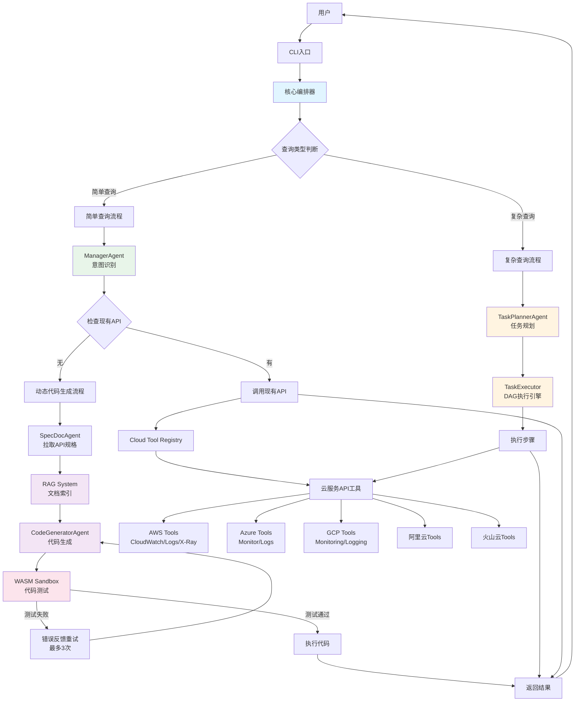
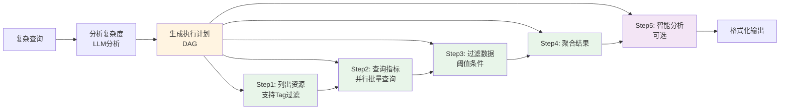
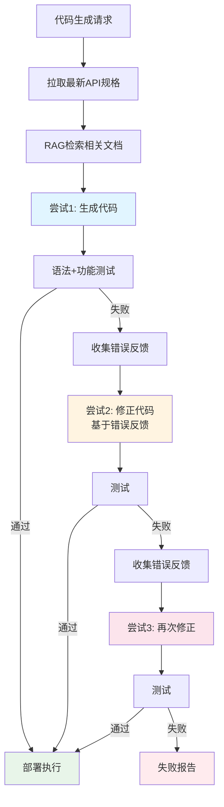
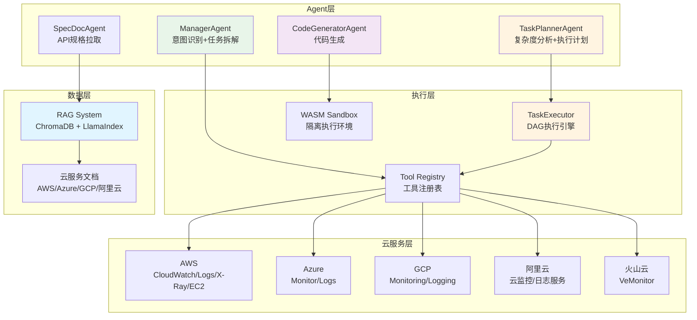
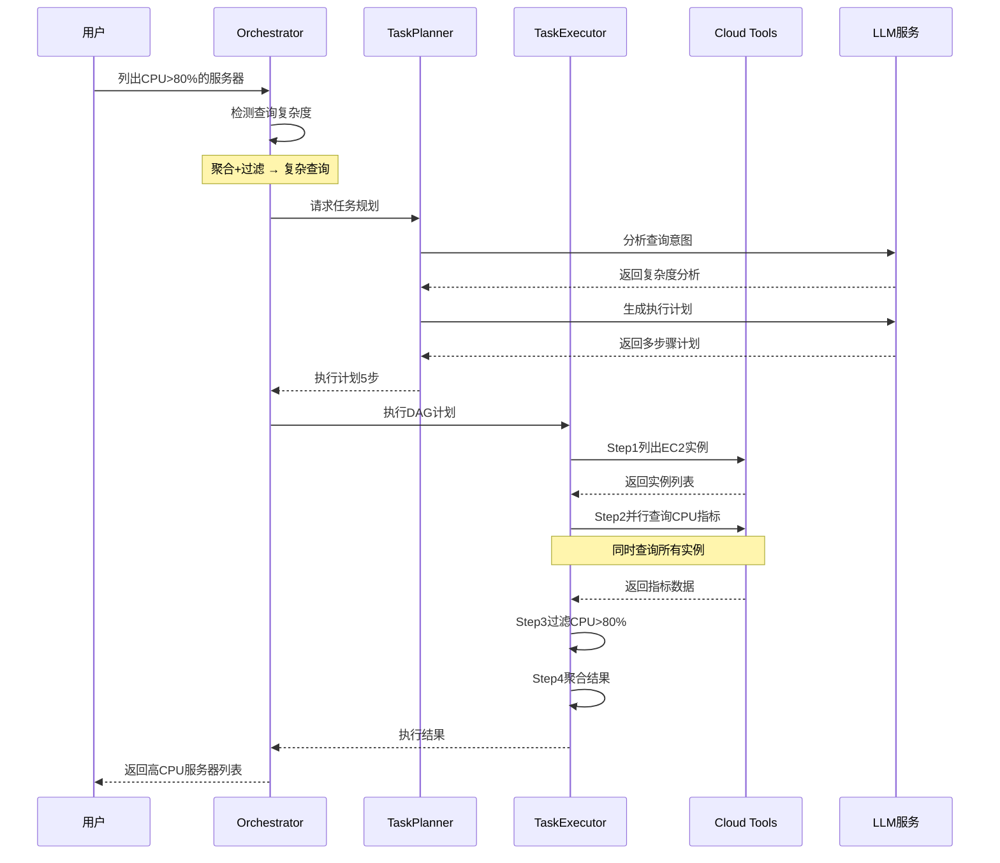
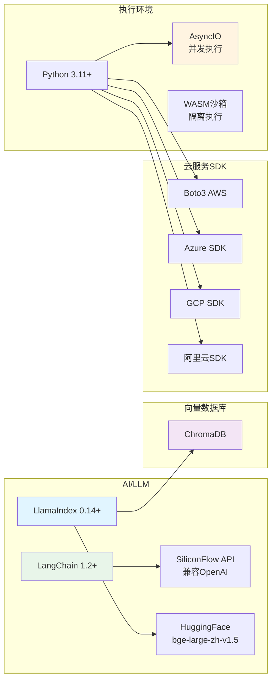
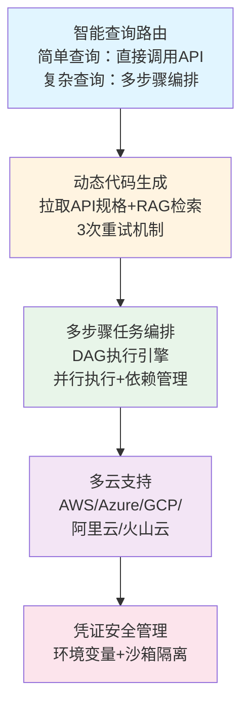

1. 整体架构

```mermaid
graph TB
    User[用户] --> CLI["CLI入口"]
    CLI --> Orchestrator["核心编排器"]

    Orchestrator --> Decision{"查询类型判断"}

    Decision -->|简单查询| SimpleFlow["简单查询流程"]
    Decision -->|复杂查询| ComplexFlow["复杂查询流程"]

    SimpleFlow --> Manager["ManagerAgent<br>意图识别"]
    Manager --> APICheck{"检查现有API"}

    APICheck -->|有| ExistingAPI["调用现有API"]
    APICheck -->|无| CodeGen["动态代码生成流程"]

    ComplexFlow --> Planner["TaskPlannerAgent<br>任务规划"]
    Planner --> Executor["TaskExecutor<br>DAG执行引擎"]

    ExistingAPI --> ToolRegistry["Cloud Tool Registry"]
    ToolRegistry --> CloudAPIs["云服务API工具"]

    CodeGen --> SpecDoc["SpecDocAgent<br>拉取API规格"]
    SpecDoc --> RAGSystem["RAG System<br>文档索引"]
    RAGSystem --> CodeGenerator["CodeGeneratorAgent<br>代码生成"]
    CodeGenerator --> Sandbox["WASM Sandbox<br>代码测试"]
    Sandbox -->|测试失败| Retry["错误反馈重试<br>最多3次"]
    Retry --> CodeGenerator
    Sandbox -->|测试通过| ExecuteCode["执行代码"]

    Executor --> StepExec["执行步骤"]
    StepExec --> CloudAPIs

    CloudAPIs --> AWSTools["AWS Tools<br>CloudWatch/Logs/X-Ray"]
    CloudAPIs --> AzureTools["Azure Tools<br>Monitor/Logs"]
    CloudAPIs --> GCPTools["GCP Tools<br>Monitoring/Logging"]
    CloudAPIs --> AliyunTools["阿里云Tools"]
    CloudAPIs --> VolcanoTools["火山云Tools"]

    ExecuteCode --> ResultResult["返回结果"]
    StepExec --> ResultResult
    ExistingAPI --> ResultResult

    ResultResult --> User

    style Orchestrator fill:#e1f5ff
    style Planner fill:#fff4e1
    style Executor fill:#fff4e1
    style Manager fill:#e8f5e9
    style CodeGenerator fill:#f3e5f5
    style Sandbox fill:#fce4ec
    style RAGSystem fill:#f3e5f5
```

---

2. 复杂查询多步骤执行流程

```mermaid
flowchart LR
    QueryComplex["复杂查询"] --> AnalyzeComplexity["分析复杂度<br>LLM分析"]
    AnalyzeComplexity --> GeneratePlan["生成执行计划<br>DAG"]

    GeneratePlan --> Step1Resource["Step1: 列出资源<br>支持Tag过滤"]
    GeneratePlan --> Step2Metric["Step2: 查询指标<br>并行批量查询"]
    GeneratePlan --> Step3Filter["Step3: 过滤数据<br>阈值条件"]
    GeneratePlan --> Step4Aggregate["Step4: 聚合结果"]
    GeneratePlan --> Step5Analyze["Step5: 智能分析<br>可选"]

    Step1Resource --> Step2Metric
    Step2Metric --> Step3Filter
    Step3Filter --> Step4Aggregate
    Step4Aggregate --> Step5Analyze

    Step5Analyze --> OutputResult["格式化输出"]

    style GeneratePlan fill:#fff4e1
    style Step1Resource fill:#e8f5e9
    style Step2Metric fill:#e8f5e9
    style Step3Filter fill:#e8f5e9
    style Step4Aggregate fill:#e8f5e9
    style Step5Analyze fill:#f3e5f5
```

---

3. 代码生成流程

```mermaid
flowchart TB
    StartCode["代码生成请求"] --> FetchSpec["拉取最新API规格"]
    FetchSpec --> RAGSearch["RAG检索相关文档"]
    RAGSearch --> GenerateAttempt1["尝试1: 生成代码"]

    GenerateAttempt1 --> TestAttempt1["语法+功能测试"]
    TestAttempt1 -->|通过| SuccessDeploy["部署执行"]
    TestAttempt1 -->|失败| FeedbackAttempt1["收集错误反馈"]

    FeedbackAttempt1 --> GenerateAttempt2["尝试2: 修正代码<br>基于错误反馈"]
    GenerateAttempt2 --> TestAttempt2["测试"]
    TestAttempt2 -->|通过| SuccessDeploy
    TestAttempt2 -->|失败| FeedbackAttempt2["收集错误反馈"]

    FeedbackAttempt2 --> GenerateAttempt3["尝试3: 再次修正"]
    GenerateAttempt3 --> TestAttempt3["测试"]
    TestAttempt3 -->|通过| SuccessDeploy
    TestAttempt3 -->|失败| FailReport["失败报告"]

    style GenerateAttempt1 fill:#e1f5ff
    style GenerateAttempt2 fill:#fff4e1
    style GenerateAttempt3 fill:#fce4ec
    style SuccessDeploy fill:#e8f5e9
    style FailReport fill:#ffebee
```

---

4. 核心组件职责

```mermaid
flowchart TB
    subgraph AgentLayer["Agent层"]
        MAgent["ManagerAgent<br>意图识别+任务拆解"]
        TPlanner["TaskPlannerAgent<br>复杂度分析+执行计划"]
        SAgent["SpecDocAgent<br>API规格拉取"]
        CGenerator["CodeGeneratorAgent<br>代码生成"]
    end

    subgraph ExecLayer["执行层"]
        TExecutor["TaskExecutor<br>DAG执行引擎"]
        WSandbox["WASM Sandbox<br>隔离执行环境"]
        TRegistry["Tool Registry<br>工具注册表"]
    end

    subgraph DataLayer["数据层"]
        RAGSystem2["RAG System<br>ChromaDB + LlamaIndex"]
        CloudDocs["云服务文档<br>AWS/Azure/GCP/阿里云"]
    end

    subgraph CloudLayer["云服务层"]
        AWSCloud["AWS<br>CloudWatch/Logs/X-Ray/EC2"]
        AzureCloud["Azure<br>Monitor/Logs"]
        GCPCloud["GCP<br>Monitoring/Logging"]
        AliCloud["阿里云<br>云监控/日志服务"]
        VolcCloud["火山云<br>VeMonitor"]
    end

    MAgent --> TRegistry
    TPlanner --> TExecutor
    CGenerator --> WSandbox
    SAgent --> RAGSystem2
    RAGSystem2 --> CloudDocs

    TExecutor --> TRegistry
    TRegistry --> AWSCloud
    TRegistry --> AzureCloud
    TRegistry --> GCPCloud
    TRegistry --> AliCloud
    TRegistry --> VolcCloud

    style MAgent fill:#e8f5e9
    style TPlanner fill:#fff4e1
    style CGenerator fill:#f3e5f5
    style TExecutor fill:#fff4e1
    style RAGSystem2 fill:#e1f5ff
```

---

5. 数据流转

```mermaid
sequenceDiagram
    participant UserU as 用户
    participant OrchO as Orchestrator
    participant PlannerP as TaskPlanner
    participant ExecutorE as TaskExecutor
    participant ToolsT as Cloud Tools
    participant LLML as LLM服务

    UserU->>OrchO: 列出CPU>80%的服务器

    OrchO->>OrchO: 检测查询复杂度
    Note over OrchO: 聚合+过滤 → 复杂查询

    OrchO->>PlannerP: 请求任务规划
    PlannerP->>LLML: 分析查询意图
    LLML-->>PlannerP: 返回复杂度分析
    PlannerP->>LLML: 生成执行计划
    LLML-->>PlannerP: 返回多步骤计划
    PlannerP-->>OrchO: 执行计划5步

    OrchO->>ExecutorE: 执行DAG计划

    ExecutorE->>ToolsT: Step1列出EC2实例
    ToolsT-->>ExecutorE: 返回实例列表

    ExecutorE->>ToolsT: Step2并行查询CPU指标
    Note over ExecutorE,ToolsT: 同时查询所有实例
    ToolsT-->>ExecutorE: 返回指标数据

    ExecutorE->>ExecutorE: Step3过滤CPU>80%
    ExecutorE->>ExecutorE: Step4聚合结果

    ExecutorE-->>OrchO: 执行结果
    OrchO-->>UserU: 返回高CPU服务器列表
```

---

6. 技术栈

```mermaid
flowchart LR
    subgraph AILLM["AI/LLM"]
        LangChainLib["LangChain 1.2+"]
        LlamaIndexLib["LlamaIndex 0.14+"]
        OpenAIAPI["SiliconFlow API<br>兼容OpenAI"]
        HFModel["HuggingFace<br>bge-large-zh-v1.5"]
    end

    subgraph VectorDB["向量数据库"]
        ChromaDBLib["ChromaDB"]
    end

    subgraph CloudSDK["云服务SDK"]
        Boto3SDK["Boto3 AWS"]
        AzureSDKLib["Azure SDK"]
        GCPSDKLib["GCP SDK"]
        AliSDKLib["阿里云SDK"]
    end

    subgraph RuntimeEnv["执行环境"]
        PythonRuntime["Python 3.11+"]
        AsyncIOEnv["AsyncIO<br>并发执行"]
        WASMSandbox["WASM沙箱<br>隔离执行"]
    end

    LangChainLib --> OpenAIAPI
    LlamaIndexLib --> ChromaDBLib
    LlamaIndexLib --> HFModel

    PythonRuntime --> Boto3SDK
    PythonRuntime --> AzureSDKLib
    PythonRuntime --> GCPSDKLib
    PythonRuntime --> AliSDKLib
    PythonRuntime --> AsyncIOEnv

    style LangChainLib fill:#e8f5e9
    style LlamaIndexLib fill:#e1f5ff
    style ChromaDBLib fill:#f3e5f5
    style AsyncIOEnv fill:#fff4e1
```

---

7. 关键特性

```mermaid
flowchart TD
    A[智能查询路由<br>简单查询：直接调用API<br>复杂查询：多步骤编排] --> B[动态代码生成<br>拉取API规格+RAG检索<br>3次重试机制]
    B --> C[多步骤任务编排<br>DAG执行引擎<br>并行执行+依赖管理]
    C --> D[多云支持<br>AWS/Azure/GCP/<br>阿里云/火山云]
    D --> E[凭证安全管理<br>环境变量+沙箱隔离]

    style A fill:#e1f5ff
    style B fill:#fff4e1
    style C fill:#e8f5e9
    style D fill:#f3e5f5
    style E fill:#fce4ec
```
